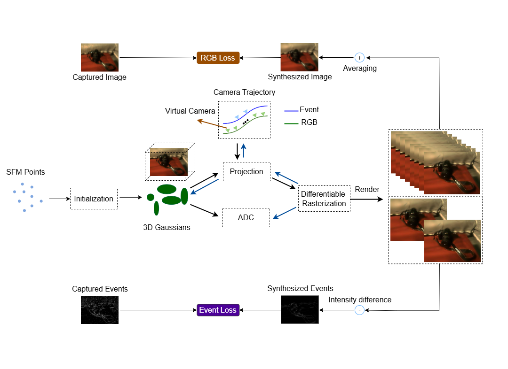

<h1 align="center">BeSplat: Gaussian Splatting from a Single Blurry Image and Event Stream</h1>
<p align="center">
    <a href="https://www.linkedin.com/in/gopi-raju-matta-1b5347105">Gopi Raju Matta</a><sup>*</sup> &emsp;&emsp;
    <a href="https://www.linkedin.com/in/reddypalli-trisha">Reddypalli Trisha</a>&emsp;&emsp;
    <a href="https://www.ee.iitm.ac.in/kmitra">Kaushik Mitra</a>&emsp;&emsp;
</p>


<hr>

<h5 align="center">This paper was accepted by the 1st Workshop on "Event-based Vision in the Era of Generative AI - Transforming Perception and Visual Innovation", held at WACV 2025.</h5>

<h5 align="center"> If you like our project, please give us a star ⭐ on GitHub.</h5>

<h5 align="center">


[](https://gopirajumatta.github.io/BeSplat/)


</h5>

> We explore the possibility of recovering sharp radiance fields (Gaussian splats) and camera motion trajectory from a single motion-blurred image. This allows BeSplat to decode the underlying sharp scene representation and video from a single blurred image and its corresponding event stream.


## 🚀 Updates  
- Project homepage is now live! Check it out [here](https://gopirajumatta.github.io/BeSplat/).  
- Training, testing, and evaluation codes, along with datasets, are now available.  
 


## 🔍 Approach

<p align="center">
    
</p>

<div>
Given a single motion-blurred image and its corresponding event stream, BeSplat recovers the underlying 3D scene representation (Gaussian splats) and the camera motion trajectory jointly. Specifically, we represent the 3D scene using Gaussian Splatting and model the camera motion trajectory with a Bézier curve in SE(3) space. Both the blurry image and the accumulated events over a time interval can be synthesized from the 3D scene representation using the estimated camera poses. The scene representation and camera trajectory are optimized by minimizing the discrepancy between the synthesized data and the real-world measurements.
</div>


## 🛠️ Setup Instructions

### Installation

Follow the setup instructions for **3D Gaussian Splatting** for environment requirements and setup. 


### Download Datasets
We use real-world datasets from **E2NeRF**, captured using the DAVIS346 color event camera, and synthetic datasets from **BeNeRF** for evaluations.

- The **real-world datasets** contain five scenes: *letter*, *lego*, *camera*, *plant*, and *toys*.
- The **synthetic datasets** from BeNeRF include three sequences from Unreal Engine: *livingroom*, *whiteroom*, and *pinkcastle*, and two sequences from Blender: *tanabata* and *outdoorpool*.

You can download the datasets from the following links:

- **[Download BeNeRF Datasets](https://westlakeu-my.sharepoint.com/:f:/g/personal/cvgl_westlake_edu_cn/EjZNs8MwoXBDqT61v_j5V3EBIoKb8dG9KlYtYmLxcNJG_Q?e=AFXeUB)**

### Training

```shell
python train.py -s <path to dataset> --eval --deblur # Train with train/test split
```

Additional Command Line Arguments for `train.py`

* `blur_sample_num`: number of key frames for trajectory time sampling
* `deblur`: switch the deblur mode
* `mode`: models of camera motion trajectory (i.e. Linear, Spline, Bezier)
* `bezier_order`: order of the Bézier curve when use Bézier curve for trajectory modeling


### Evaluation

```shell
python train.py -s <path to dataset> --eval # Train with train/test split
python render.py -m <path to trained model> # Generate renderings
python metrics.py -m <path to trained model> # Compute error metrics on renderings
```

Additional Command Line Arguments for `render.py`

* `optim_pose`: optimize the camera pose to align with the dataset

### Render Video

```shell
python render_video.py -m <path to trained model>
```

### Results
You can check our results at the following link.

- [https://gopirajumatta.github.io/BeSplat/](https://gopirajumatta.github.io/BeSplat/)


## ✒️ Citation 
If you find this repository useful, please consider citing our paper:
```bibtex
@InProceedings{Matta_2025_WACV,
    author    = {Matta, Gopi Raju and Reddypalli, Trisha and Mitra, Kaushik},
    title     = {BeSplat: Gaussian Splatting from a Single Blurry Image and Event Stream},
    booktitle = {Proceedings of the Winter Conference on Applications of Computer Vision (WACV) Workshops},
    month     = {February},
    year      = {2025},
    pages     = {917-927}
}
```


## 🙏 Acknowledgment
In our work, the camera trajectory optimization was inspired by [Deblur-GS](https://github.com/google-research/deblur-gs), and the event stream integration into Gaussian Splatting was inspired by the methodology used in [BeNeRF](https://github.com/akawincent/BeNeRF). The overall code framework is based on both repositories. We appreciate the efforts of the contributors to these amazing projects.

